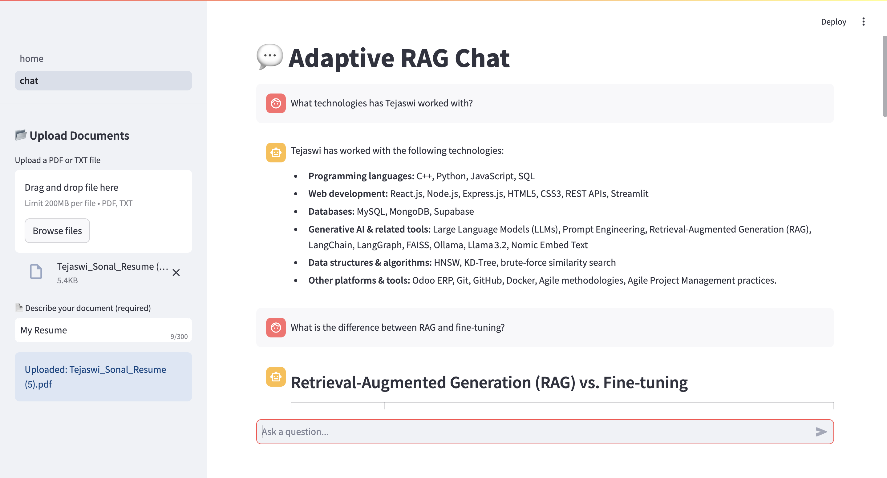
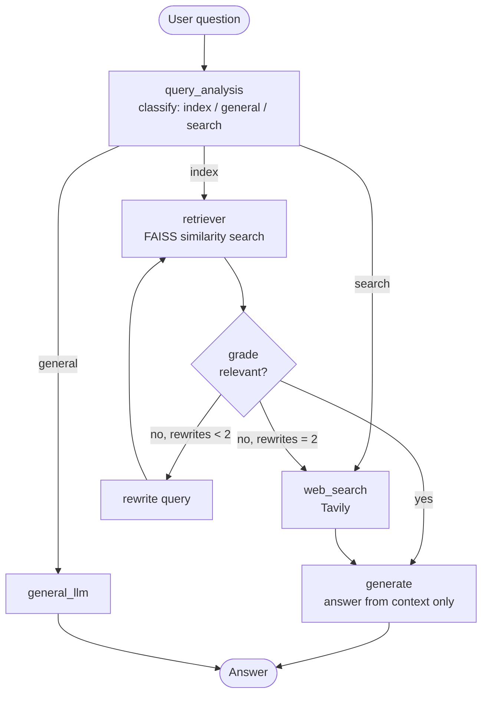

# Adaptive RAG — Agentic, Self-Correcting RAG Chatbot

[](https://www.python.org/downloads/)
[](https://fastapi.tiangolo.com)
[](https://langchain-ai.github.io/langgraph/)
[](LICENSE)

A retrieval-augmented chatbot whose LangGraph agent decides **how** to answer each question: from your uploaded documents, from the LLM's general knowledge, or from a live web search. Retrieved documents are graded for relevance; if they miss, the query is rewritten and retried, and after two failed attempts the agent falls back to web search.

**Live demo:** [tejaswi75-adaptive-rag.streamlit.app](https://tejaswi75-adaptive-rag.streamlit.app/)



## How it works



| Node | What it does |
|---|---|
| `query_analysis` | Retrieves candidate context and asks the LLM to route the question (`index`, `general`, `search`) |
| `retriever` | Similarity search over the FAISS index of the uploaded document |
| `grade` | LLM judge: is the retrieved context relevant to the question? |
| `rewrite` | Reformulates the query for a better retrieval; capped by `MAX_REWRITES` |
| `web_search` | Tavily search, used for current-events questions and as the retrieval fallback |
| `generate` | Answers strictly from the context, or says the information isn't available |
| `general_llm` | Answers general-knowledge questions directly |

## Tech stack

| Component | Technology |
|---|---|
| Agent workflow | [LangGraph](https://langchain-ai.github.io/langgraph/) + LangChain |
| LLM | [Groq](https://console.groq.com/docs/models), model set by `GROQ_MODEL` (tested with `openai/gpt-oss-120b`) |
| Embeddings | [FastEmbed](https://github.com/qdrant/fastembed) (`all-MiniLM-L6-v2`, ONNX, no PyTorch) |
| Vector store | [FAISS](https://github.com/facebookresearch/faiss) |
| Web search | [Tavily](https://tavily.com) |
| Chat memory | MongoDB, or in-memory when no database is configured |
| Backend / frontend | FastAPI / Streamlit |

## Evaluation

`eval/` contains a reproducible end-to-end evaluation: a fictional company handbook, 20 questions with reference answers (17 document questions, 2 general, 1 web-search), and a script that uploads the document, queries the running backend, and scores each answer with an LLM judge.

```bash
python eval/run_eval.py --label with-grader
# restart the backend with ENABLE_GRADER=false, then:
python eval/run_eval.py --label without-grader
```

It reports document-QA accuracy, routing accuracy, how often a rewrite was needed, and latency. Comparing the two runs shows what the grade → rewrite loop adds.

**Results** (`openai/gpt-oss-120b` on Groq, with grader + rewriter):

| Metric | Result |
|---|---|
| Document-QA accuracy | **100%** (17/17) |
| Routing accuracy (index / general / search) | **100%** (20/20) |
| Overall accuracy | 95% (19/20; the one web-search question was judged incorrect) |
| Median latency per question | 12.4 s (free-tier rate limits) |

On this small, clean document every first retrieval was relevant, so no query rewrites were triggered. The `ENABLE_GRADER=false` run is the comparison to make on harder, noisier documents.

## Getting started

**Requirements:** Python 3.11 or 3.12, a [Groq API key](https://console.groq.com/keys) and a [Tavily API key](https://app.tavily.com).

```bash
git clone https://github.com/Tejaswi75/Adaptive-RAG.git
cd Adaptive-RAG
python -m venv venv
source venv/bin/activate          # Windows: venv\Scripts\activate
pip install -r requirements.txt
cp .env.example .env              # then add your API keys
```

Start the backend and the UI in two terminals:

```bash
uvicorn src.main:app --reload --reload-dir src   # API on http://127.0.0.1:8000 (docs at /docs)
streamlit run streamlit_app/home.py      # UI on http://localhost:8501
```

### Configuration

| Variable | Default | Purpose |
|---|---|---|
| `GROQ_API_KEY` | — | LLM inference (required) |
| `TAVILY_API_KEY` | — | Web search (required) |
| `GROQ_MODEL` | `llama-3.3-70b-versatile` | Groq chat model |
| `MONGO_URI` | unset | MongoDB for chat history. If unset, history is kept in memory (lost on restart) |
| `BACKEND_URL` | `http://127.0.0.1:8000` | Where the Streamlit UI reaches the API |
| `MAX_REWRITES` | `2` | Query rewrites before falling back to web search |
| `ENABLE_GRADER` | `true` | `false` skips grading and rewriting (evaluation ablation) |
| `LOG_LEVEL` | `INFO` | `DEBUG` also logs retrieved context |

### Deploy (Streamlit Community Cloud, free)

Set `EMBEDDED_BACKEND=true` and the Streamlit app runs the backend code in-process, so the whole project deploys as one Streamlit app:

1. On [share.streamlit.io](https://share.streamlit.io), create an app from this repo, branch `main`, main file `streamlit_app/home.py`, Python 3.12 (Advanced settings; newer versions are not supported by the pinned dependencies).
2. In **Secrets**, add:
   ```toml
   EMBEDDED_BACKEND = "true"
   GROQ_API_KEY = "..."
   TAVILY_API_KEY = "..."
   GROQ_MODEL = "openai/gpt-oss-120b"
   ```

For container platforms, the `Dockerfile` runs the API and UI together (UI on port 7860).

## API

| Method | Endpoint | Description |
|---|---|---|
| `POST` | `/rag/documents/upload` | Multipart `file` (PDF/TXT), `X-Description` header, and `X-Session-Id` header (the chat session to index it for) |
| `POST` | `/rag/query` | Body `{"query": "...", "session_id": "..."}`; returns the answer, the route taken and the number of rewrites |

## Project structure

```
Adaptive-RAG/
├── src/
│   ├── api/            FastAPI routes
│   ├── config/         Prompt templates (prompts.yaml)
│   ├── core/           Settings and logging
│   ├── db/             MongoDB client
│   ├── llms/           Groq LLM setup
│   ├── memory/         Chat history (MongoDB / in-memory)
│   ├── models/         Graph state and structured-output schemas
│   ├── rag/            Graph, nodes, retriever, document upload
│   └── tools/          Routing and grading logic
├── streamlit_app/      Chat UI
├── eval/               Evaluation set and runner
└── docs/               Screenshots
```

## Known limitations

- Each chat session has its own FAISS index (the last `MAX_SESSIONS`, default 50, are kept). Indexes live in memory and reset when the backend restarts; starting a new chat starts without documents.
- Uploading another file in the same session replaces the previous one.

## Author

**Tejaswi Sonal** · [GitHub](https://github.com/Tejaswi75) · [Portfolio](https://tejaswi75.github.io/)

## License

[MIT](LICENSE)
